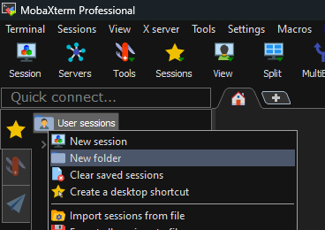
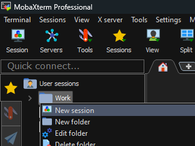
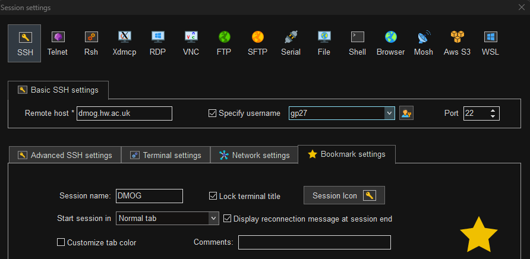
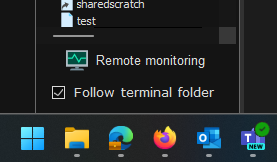

Connecting to DMOG
==================

Before following the process below, this guide assumes you have an account on the cluster. 
If that is not the case, you can request one by contacting ISHelp@hw.ac.uk

Interaction with DMOG is done remotely via SSH (Secure Shell). 
To connect to another machine using SSH you need to have a SSH client program installed on your machine. 
macOS, Linux, and newer versions of Windows come with a command-line (text-only) SSH client pre-installed. 
On older Windows versions there are various graphical SSH clients you can use like PuTTY or MobaXterm.

Using your favorite SSH client, just type:

.. code-block:: bash

   ssh <username>@dmog.hw.ac.uk

Note: the cluster is accessible within the University network. For remote access you need to log on 
to the `University VPN <https://www.hw.ac.uk/uk/services/is/it-essentials/virtual-private-network-vpn.htm>`_ , or request access to the SSH gateway via the self-service portal first.

VSCode via Slurm
----------------
.. _vsCodeSlurm:

To create a job on DMOG and have VSCode connect to the job to debug code etc:

You will need to have an SSH keypair set up for connecting to DMOG.

Open VSCode, install the 'Remote - SSH' extension.

Modify/create your SSH config file (Windows: C:\\users\\[username]\\.ssh\\config Mac/Linux: ~/.ssh/config) to include the following:

Note that you may need to create the '.ssh' folder and the 'config' config file if they are not already there.

.. code-block:: bash
  
  Host dmog
    User [YOUR USERNAME]
    IdentityFile [PATH TO YOUR DMOG SSH PRIV KEY]
    ControlMaster auto
    HostName dmog.hw.ac.uk

  Host hpc-job
    User [YOUR USERNAME]
    IdentityFile [PATH TO YOUR DMOG SSH PRIV KEY]
    ProxyCommand ssh dmog 'nc $(squeue --me --name=vsCode --states=R -h -O NodeList) 2222'
    StrictHostKeyChecking no

SSH in to DMOG via command line (or other SSH client you normally use)

Create a file called ``vsCode.sh``, Set its contents to:

.. code-block:: bash

  srun --job-name "vsCode" --cpus-per-task 2 --mem-per-cpu 500 --time 1:00:00 sshd -D -p 2222 -f /dev/null -h ~/.ssh/id_alcescluster

Allow it to be executed:
    
``chmod +x vsCode.sh``

Run the ``vsCode.sh`` script. Then go to VS Code and connect to the hpc-job host under remote connections on the left.

Configure MobaXTerm for DMOG
----------------------------

MobaXTerm is an SSH/SCP/SFTP client available for Windows. As it has SCP/SFTP functionality built-in it simplifies copying files to/from DMOG.

It is available from here: `MobaXTerm <https://mobaxterm.mobatek.net/download.html>`_

Create a Work folder on the left by right-clicking User Sessions and selecting new folder:

Right-click the work folder and select New session:

In the new session window select SSH. In the Remote Host field enter dmog.hw.ac.uk

Check the box next to Specify Username and enter your DMOG username into the field

Bookmark Settings and enter DMOG into the Session Name field then click OK:

Double-click the DMOG session on the left of the window, you will be prompted for your DMOG password to log in. Note that whenever you are prompted for a password you will not be able to see what you are typing, not even \*s.

Once logged in, at the bottom left of the window check the box next to Follow Terminal Folder:

The area to the left of the Window will allow you to see the files in the folder you are currently inside, as well as create new folders, and upload files/folders to the folder you are currently in.

To upload files from your Windows PC to DMOG, you can either drag and drop files onto this panel on the left to, or use the Up arrow to select files to upload. You can also download files from DMOG to your computer by selecting them on the left panel and clicking the Down arrow.

