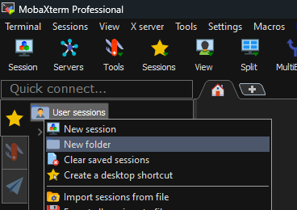
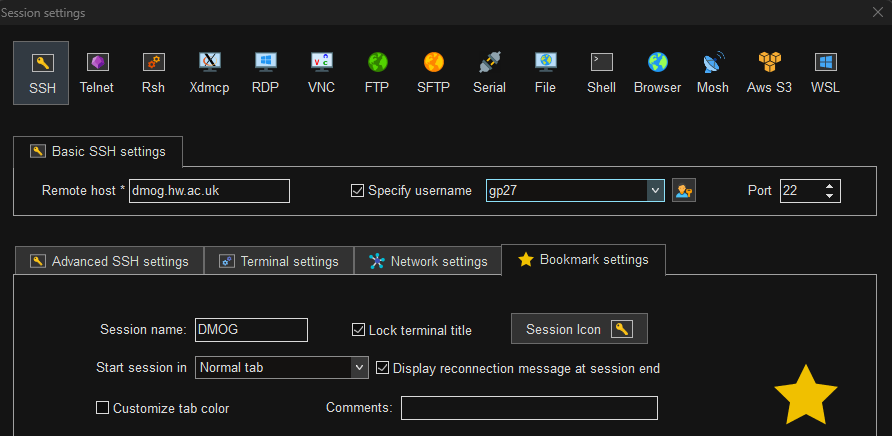
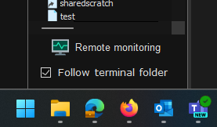

Configure MobaXTerm for DMOG
============================

Create a Work folder on the left by right-clicking User Sessions and selecting new folder:

Right-click the work folder and select New session:

.. image:: mobaxterm2.png
  :width: 300

In the new session window select SSH. In the Remote Host field enter dmog.hw.ac.uk

Check the box next to Specify Username and enter your DMOG username into the field

Bookmark Settings and enter DMOG into the Session Name field then click OK:

Double-click the DMOG session on the left of the window, you will be prompted for your DMOG password to log in. Note that whenever you are prompted for a password you will not be able to see what you are typing, not even \*s.

Once logged in, at the bottom left of the window check the box next to Follow Terminal Folder:

The area to the left of the Window will allow you to see the files in the folder you are currently inside, as well as create new folders, and upload files/folders to the folder you are currently in.

To upload files from your Windows PC to DMOG, you can either drag and drop files onto this panel on the left to, or use the Up arrow to select files to upload. You can also download files from DMOG to your computer by selecting them on the left panel and clicking the Down arrow.
